  
[](https://hackaday.com/2025/10/02/building-a-desk-display-for-time-and-weather-data)
[](https://www.xda-developers.com/super-sleek-esp32-weather-station)
[](https://www.hackster.io/news/the-perfect-minimalist-led-clock-49a4e4440518)

🎉 **1,000+ GitHub stars - thank you to the community!**  

**ESPTimeCast™** is a sleek, WiFi-connected LED matrix clock and weather display built on **ESP8266/ESP32** and **MAX7219**.
It combines real-time NTP time sync, live OpenWeatherMap updates, and a modern web-based configuration interface — all in one compact design.


<video src="https://github.com/user-attachments/assets/78b6525d-8dcd-43fc-875e-28805e0f4fab"></video>
&nbsp;
#### 🎨 A Note on Custom Cases & Commercial Listings

I love seeing the community’s creativity and fully encourage you to design, share, and even sell your own custom enclosures for **ESPTimeCast™**.

If you build one, feel free to share it with the community, there’s even a dedicated showcase thread on [**r/ESPTimeCast**](https://www.reddit.com/r/ESPTimeCast/comments/1p2vt16/show_your_esptimecast_build_post_your_photos_setup/) where makers post their builds and setups.

However, while the hardware and firmware are open-source, the **Signature Custom Font** is part of the project’s protected visual identity. To avoid brand confusion and keep the project sustainable, a small rule applies when it comes to commercial listings.

* **The Rule:** Photos showing the **ESPTimeCast™ custom font or weather icons** may **not be used in commercial listings** (MakerWorld, Printables, Etsy, Cults3D, etc).

* **The Solution:** If you are selling or promoting a case or accessory, please use the included **Basic Font** or a **blank display** in your product photos.

* **Why?:** The distinctive look of the custom font is what visually defines **ESPTimeCast™**. Limiting its use in commercial listings helps prevent the project’s branding and visual design from being used to promote unrelated products.

See the **Full Usage & Branding Guidelines** here: [Usage & Branding Guidelines](https://github.com/mfactory-osaka/ESPTimeCast/edit/main/README.md#%EF%B8%8F-esptimecast-branding--visual-policy)

🙏 Thank you to everyone who has already updated their listings to respect this guideline, and thanks in advance to future creators for helping keep the project’s visual identity clear while continuing to share amazing builds.  

&nbsp;
&nbsp;
## 🚀 Install in Under a Minute (Recommended)

Flash ESPTimeCast directly from your browser — no Arduino IDE, no drivers setup, no manual configuration.

👉 **Web Installer:**  
https://esptimecast.github.io

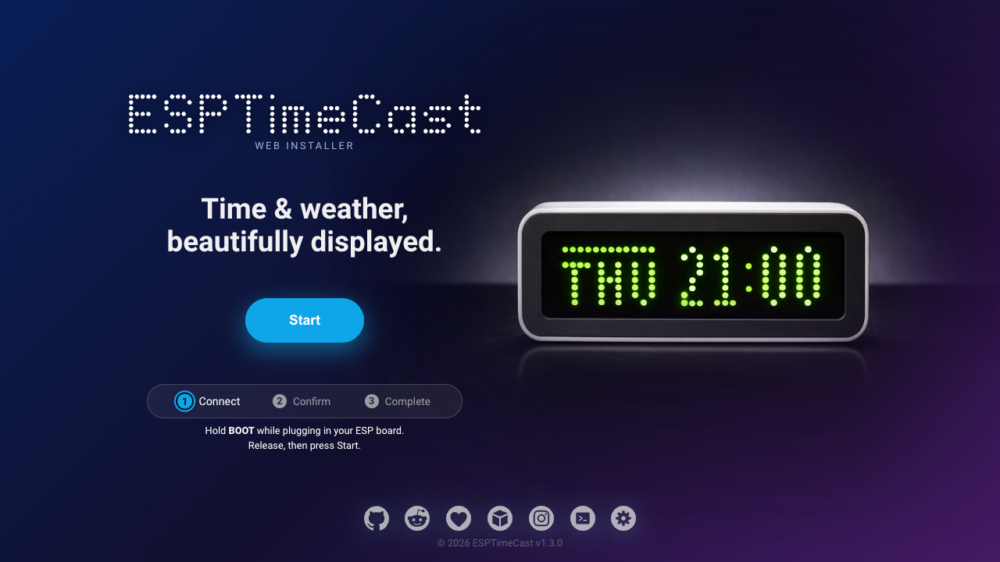

> After flashing, connect to the ESPTimeCast WiFi access point to complete setup.

### ✅ Officially Tested Boards

- Wemos D1 Mini (ESP8266)
- ESP32 Dev Module
- ESP32-C3 SuperMini
- Wemos S2 Mini (ESP32-S2)
- ESP32-S3 WROOM-1 (Camera/SD board)


### Compatible Chip Families

ESPTimeCast supports the following chip families:

- ESP8266
- ESP32
- ESP32-S2
- ESP32-C3
- ESP32-S3 

Other development boards using these chips may work,  
but pin mapping and USB behavior can vary.

📌 **Wiring guide:**  
See the [hardware connection table](https://github.com/mfactory-osaka/ESPTimeCast#-wiring-your-esptimecast).


🔄 **About Updates:**  
The browser-based update feature is designed for installations originally flashed using the Web Installer.  
If you installed ESPTimeCast manually via Arduino IDE, the web update function may not work reliably.

> Requires Chrome, Edge, or Brave (Web Serial support).

&nbsp;
## 📦 3D Printable Case

To help support the project’s development, the official **ESPTimeCast™** case design is available as a **paid STL download** (see links below).  

If you prefer a free option, there are many compatible **MAX7219 LED matrix enclosures** shared by the community - you can find plenty by searching for “MAX7219 case” on Printables, Cults3D, or similar sites.


<p align="left">
  <a href="https://www.printables.com/model/1344276-esptimecast-wi-fi-clock-weather-display">
    
  </a>
  <br>
  <a href="https://cults3d.com/en/3d-model/gadget/wifi-connected-led-matrix-clock-and-weather-station-esp8266-and-max7219">
    
  </a>
</p>

&nbsp;
## 🖼️ Community Builds Gallery

A small selection of ESPTimeCast™ builds from the community ❤️  

<p align="center">
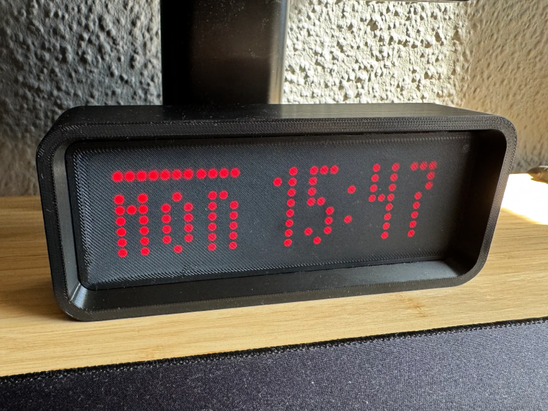 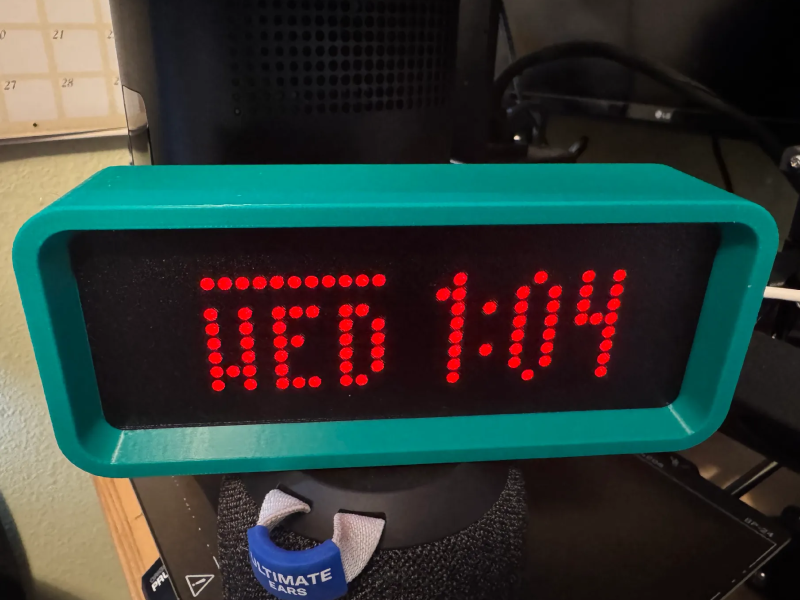 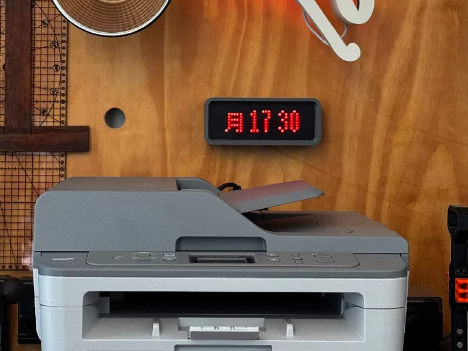 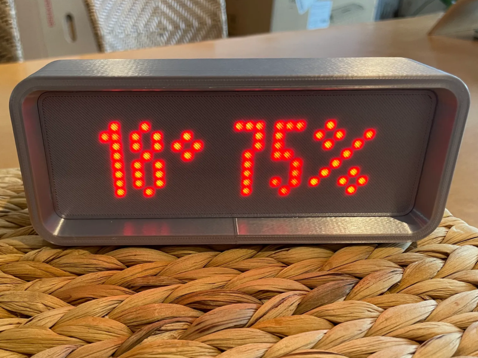 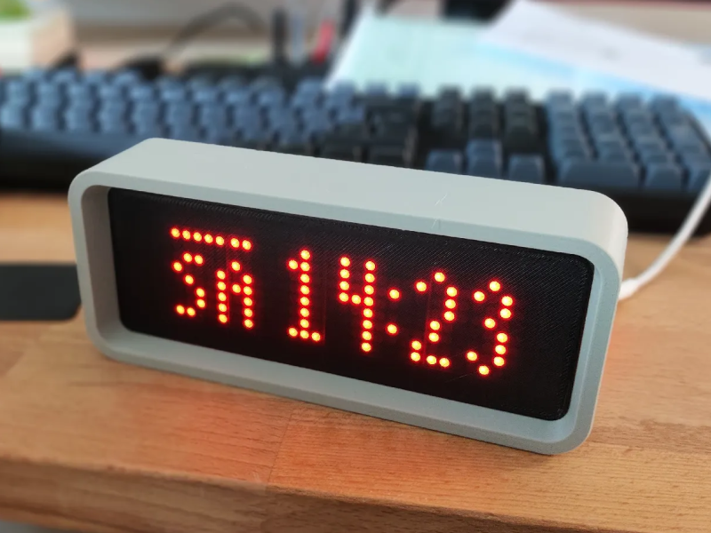 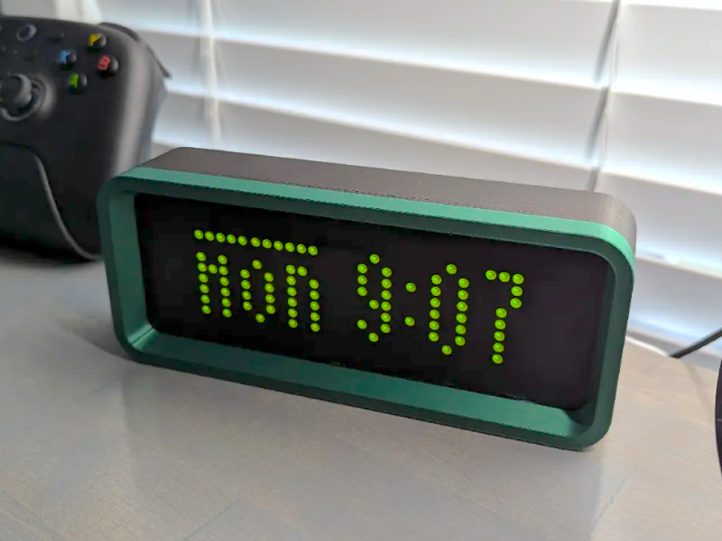 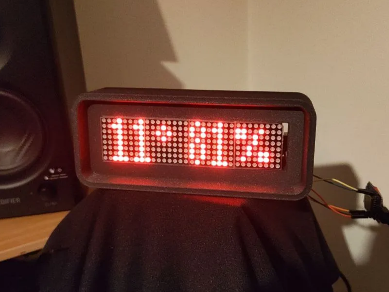 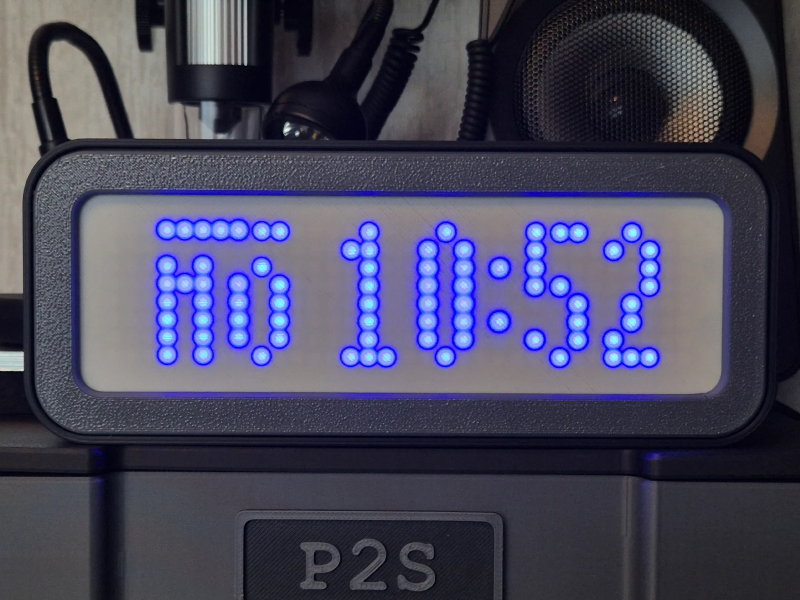 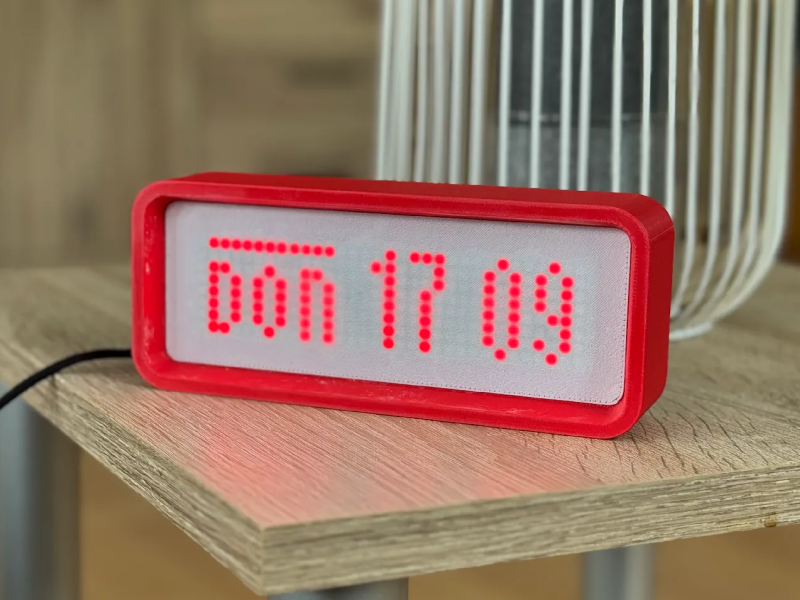 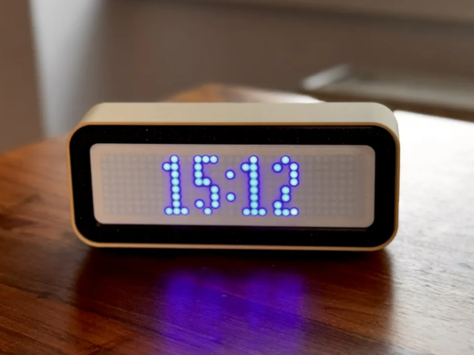 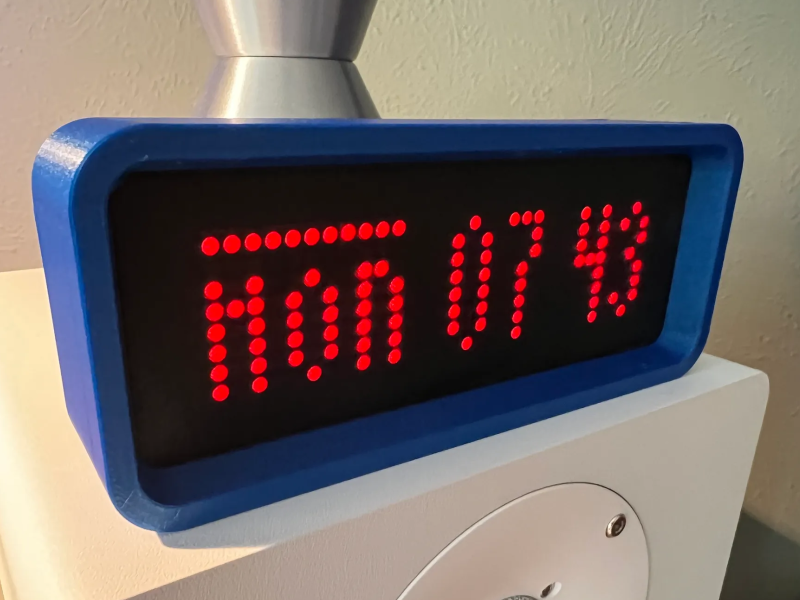 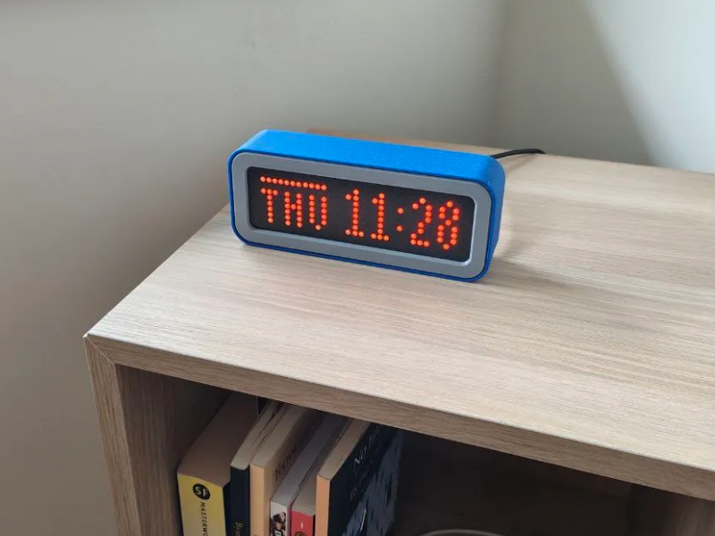
</p>

Huge thanks to all the makers on Printables who shared their ESPTimeCast™ builds featured here:

Achduka, ChrisBalo_2103728, LazyManJoe_199553, LeoB_746630, Manni0605_464156, Purduesi_774301, rhe_3695705, sardaukar_1942598, Stefan_37395, TO3IAS, thirddimensionlabs  

You all made this community showcase possible - thank you! 🙏  

Want your build featured here?  
Share your photos on [r/ESPTimeCast](https://www.reddit.com/r/ESPTimeCast/comments/1p2vt16/show_your_esptimecast_build_post_your_photos_setup/) - I’d love to showcase more builds! 📸

&nbsp;
## 📰 Press Mentions

ESPTimeCast™ has been featured on major maker and tech platforms highlighting its design, usability, and open-source community. 
- [Hackaday](https://hackaday.com/2025/10/02/building-a-desk-display-for-time-and-weather-data)  
- [XDA Developers](https://www.xda-developers.com/super-sleek-esp32-weather-station)
- [Hackster.io](https://www.hackster.io/news/the-perfect-minimalist-led-clock-49a4e4440518)

&nbsp;
## ✨ Features

- **LED Matrix Display (8x32)** powered by MAX7219, with custom font support
- **Simple Web Interface** for all configuration (WiFi, weather, time zone, display durations, and more)
- **Automatic NTP Sync** with robust status feedback and retries
- **Weather Fetching** from OpenWeatherMap (every 5 minutes, temp/humidity/description)
- **Custom Scroll Messages** - fully persistent until manually cleared via the Web UI
- **Fallback AP Mode** for easy first-time setup or configuration
- **Timezone Selection** from IANA names (DST integrated on backend)
- **Get My Location** button to get your approximate Lat/Long
- **Week Day and Weather Description display** in multiple languages
- **Persistent Config** stored in LittleFS, with backup/restore system
- **Status Animations** for WiFi connection, AP mode, time syncing
- **Advanced Settings** panel with:
  - Custom **Primary/Secondary NTP server** input
  - Display **Day of the Week** toggle (default is on)
  - Display **Blinking Colon** toggle (default is on)
  - Show **Date** toggle (default is off)
  - **24/12h clock mode** toggle (24-hour default)
  - **Imperial Units (°F)** toggle (metric °C defaults)
  - Show **Humidity** toggle (display Humidity besides Temperature)
  - **Weather description** toggle (displays: heavy rain, scattered clouds, thunderstorm etc.)
  - **Flip display** (180 degrees)
  - Adjustable display **brightness**
  - **Automatic Dimming** based on Sunrise/Sunset from weather API
  - **Custom Dimming** select custom dimming hours
  - **Countdown** function (Scroll / Dramatic)
  - **Optional:** ESPTimeCast supports displaying glucose data from **Nightscout** servers every 5 minutes, alternating with weather information
  - **Optional:** Export and Upload settings via `device-ip/export` and `device-ip/upload` endpoints

&nbsp;
## 🪛 Wiring your ESPTimeCast

ESPTimeCast uses **board-specific recommended SPI pin mappings** 
to ensure consistent behavior, stable power delivery, and reliable brightness.

&nbsp;
### 📌 Current Pin Assignment

The following pin mappings correspond to the official Web Installer builds.
If you are compiling manually, ensure your pin definitions match this table.

| Chip       | Board / Module                     | CLK | CS | DIN | VCC | GND |
|------------|------------------------------------|:---:|:--:|:---:|:---:|:---:|
| ESP8266    | D1 Mini (USB-C / Micro-USB)        | 14  | 13 | 15  | 5V  | GND |
| ESP32      | ESP32 Dev Module / D1 Mini ESP32 (not ESP8266) | 18 | 23 | 5 | 5V | GND |
| ESP32-S2   | S2 Mini                            | 7   | 11 | 12  | 5V  | GND |
| ESP32-C3   | SuperMini (Updated GPIO Mapping as of v1.3.2)                        | 4   | 10 | 6   | 5V  | GND |
| ESP32-S3   | WROOM-1 (Camera / SD board)        | 18 | 16 | 17  | 5V  | GND |


> The table lists **raw GPIO numbers**.  
> MAX7219 modules are typically powered at **5V** but accept **3.3V logic** on DIN / CLK / CS.  
> All ESP32 boards listed above have been **tested successfully** with this wiring.  
> ESP8266 D1 Mini boards are often labeled using **D-pins** (D5 = GPIO14, D7 = GPIO13, D8 = GPIO15).
> Other boards using the same chip families may work, but SPI pins may differ depending on the manufacturer layout.
> ESP32-C3 SuperMini mapping changed to avoid strapping pin conflicts and boot issues present on some boards.

&nbsp;
### 🧩 Wiring Diagram


> **Tip:** Double-check the pin order on your MAX7219 module — labeling and orientation can vary between manufacturers.

&nbsp;
### 🔄 Upgrading from an older build?

If your device was wired before **Oct 17, 2025**, please verify the following:

- **CLK** is connected to **D5**  
- **VCC** is connected to **5V** (not 3.3V)  
- Flashing via the web installer automatically applies the correct defaults


&nbsp;
## First-time Setup / AP Mode

1. Power on the device. If WiFi fails, it auto-starts in AP mode:
   - **SSID:** `ESPTimeCast`
   - **Password:** `12345678`
   - Captive portal should open automatically, if it doesn't open `http://192.168.4.1` or `http://setup.esp` in your browser.
2. Set your WiFi and all other options.
3. Click **Save Setting** – the device saves config, reboots, and connects.
4. The device shows its local IP address after boot so you can login again for setting changes

> External links and the "Get My Location" button require internet access.  
They won't work while the device is in AP Mode - connect to WiFi first.

&nbsp;
## 🌐 Web UI & Configuration

ESPTimeCast includes a built-in Web UI that lets you fully configure the device from any browser — no apps required.

#### You can open the Web UI using either:

- http://esptimecast.local  
mDNS / Bonjour - Works on macOS, iOS, Windows with Bonjour, and most modern browsers.

- The device’s **local IP address**  
→ On every reboot, ESPTimeCast shows its IP on the LED display so you can easily connect.

#### The Web UI gives you control over:
- **WiFi settings** (SSID & Password)
- **Weather settings** (OpenWeatherMap API key, City, Country, Coordinates)
- **Time zone** (will auto-populate if TZ is found)
- **Day of the Week and Weather Description** languages
- **Display durations** for clock and weather (milliseconds)
- **Custom Scroll Text** - set a persistent scrolling message on the display directly from the Web UI
- **Advanced Settings** (see below)

&nbsp;
## UI Example:
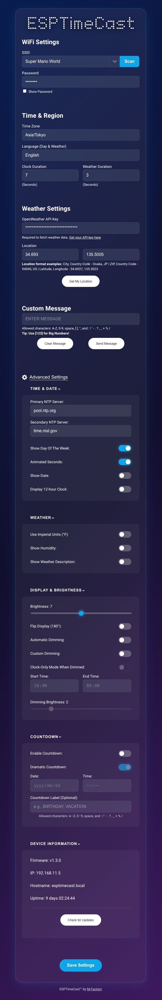

&nbsp;
## ⚙️ Advanced Settings

Click the **cog icon** next to “Advanced Settings” in the Web UI to reveal extra configuration options.  

**Available advanced settings:**

- **Primary NTP Server**: Override the default NTP server (e.g. `pool.ntp.org`)
- **Secondary NTP Server**: Fallback NTP server (e.g. `time.nist.gov`)
- **Day of the Week**: Display Day of the Week in the desired language
- **Blinking Colon** toggle (default is on)
- **Show Date** (default is off, duration is the same as weather duration)
- **24/12h Clock**: Switch between 24-hour and 12-hour time formats (24-hour default)
- **Imperial Units (°F)** toggle (metric °C defaults)
- **Humidity**: Display Humidity besides Temperature
- **Weather description** toggle (display weather description in the selected language for 3 seconds or scrolls once if description is too long)
- **Flip Display**: Invert the display vertically/horizontally
- **Brightness**: Off - 0 (dim) to 15 (bright)
- **Automatic Dimming Feature** base on Sunrise/Sunset from weather API
- **Custom Dimming Feature**: Start time, end time and desired brightness selection
- **Countdown** function, set a countdown to your favorite/next event, 2 modes: Scroll/Dramatic! 

>Non-English characters converted to their closest English alphabet.   
>For Esperanto, Irish, and Swahili, weather description translations are not available. Japanese translations exist, but since the device cannot display all Japanese characters, English will be used in all these cases.  

> **Tip:** Don't forget to press the save button to keep your settings

&nbsp;
## 📝 Configuration Notes

- **OpenWeatherMap API Key:**
   - [Make an account here](https://home.openweathermap.org/users/sign_up)
   - [Check your API key here](https://home.openweathermap.org/api_keys)
- **City Name:** e.g. `Tokyo`, `London`, etc.
- **Country Code:** 2-letter code (e.g., `JP`, `GB`)
- **ZIP Code:** Enter your ZIP code in the city field and US in the country field (US only)
- **Latitude and Longitude** You can enter coordinates in the city field (lat.) and country field (long.)
- **Time Zone:** Select from IANA zones (e.g., `America/New_York`, handles DST automatically)

### Time Offset (minutes)
- You can shift the displayed clock forward or backward by a small minute offset for presentation or testing.
- Where: available in the web UI under **Clock Settings → Time Offset (minutes)**.
- Range: -60 to +60 (minutes). A value of `3` will display the clock 3 minutes ahead.
- Behavior: this offset only affects the text shown on the matrix display; internal logic (dimming, countdown target checks, sunrise/sunset calculations) continues to use the real system time.
- How to use:
  1. Open the device web UI.
  2. In **Clock Settings**, set **Time Offset (minutes)** to the desired value (e.g. `3`).
  3. Save settings and allow the device to reboot.
  4. Confirm the matrix display shows the adjusted time.

&nbsp;
&nbsp;
## 🚀 Getting Started

There are two ways to install ESPTimeCast:

### 🥇 Recommended: Web Installer (Fastest)
Flash directly from your browser in under a minute:
https://esptimecast.github.io

### 🛠 Manual Installation (Arduino IDE)
If you prefer compiling and uploading manually, follow the instructions below.

#### ⚙️ ESP8266 Setup

Follow these steps to prepare your Arduino IDE for ESP8266 development:

1.  **Install ESP8266 Board Package:**
    * Open `File > Preferences` in Arduino IDE.
    * Add `http://arduino.esp8266.com/stable/package_esp8266com_index.json` to "Additional Boards Manager URLs."
    * Go to `Tools > Board > Boards Manager...`. Search for `esp8266` by `ESP8266 Community` and click "Install".
2.  **Select Your Board:**
    * Go to `Tools > Board` and select your specific board, e.g., **Wemos D1 Mini** (or your ESP8266 variant).
3.  **Configure Flash Size:**
    * Under `Tools`, select `Flash Size "4MB FS:2MB OTA:~1019KB"` or `Flash Size "Mapping defined by Hardware and Sketch"`. This ensures enough space for the sketch and LittleFS data.
4.  **Install Libraries:**
    * Go to `Sketch > Include Library > Manage Libraries...` and install the following:
        * `ArduinoJson` by Benoit Blanchon
        * `MD_Parola` by majicDesigns (this will typically also install its dependency: `MD_MAX72xx`)
        * `ESPAsyncTCP` by ESP32Async
        * `ESPAsyncWebServer` by ESP32Async (3.9.1 or above)  
&nbsp;
#### ⚙️ ESP32 Setup

Follow these steps to prepare your Arduino IDE for ESP32 development:
1.  **Install ESP32 Board Package:**
    * Go to `Tools > Board > Boards Manager...`. Search for `esp32` by `Espressif Systems` and click "Install".
2.  **Select Your Board:**
    * Go to `Tools > Board` and select your specific board, e.g., **LOLIN S2 Mini** (or your ESP32 variant).
3.  **Configure Partition Scheme:**
    * Go to `Tools > Partition Scheme` and choose one of the following:
        * **For OTA support (recommended):**  
          `Minimal SPIFFS (1.9MB APP with OTA / 128KB SPIFFS)`  
          This enables wireless firmware updates via the built-in web interface.
        * **Without OTA support:**  
          `No OTA (2MB APP / 2MB SPIFFS)` or `No OTA (LARGE APP)`  
          These provide a larger filesystem but do not support OTA updates.        
&nbsp;
    > **Note:** OTA works out of the box with the official Web Installer build.  
    > Manual builds are fully supported as well - just make sure you're using the recommended pinout for your specific board as documented in this repository.  
    > **Important:** If the `Minimal SPIFFS` option does not appear, make sure you have selected **Dev Module** for your specific ESP32 chip family (e.g., ESP32 Dev Module, ESP32-S2 Dev Module, ESP32-C3 Dev Module).  

4.  **Install Libraries:**
    * Go to `Sketch > Include Library > Manage Libraries...` and install the following:
        * `ArduinoJson` by Benoit Blanchon
        * `MD_Parola` by majicDesigns (this will typically also install its dependency: `MD_MAX72xx`)
        * `AsyncTCP` by ESP32Async
        * `ESPAsyncWebServer` by ESP32Async
    
&nbsp;
#### ⬆️ Uploading the Code and Data

Once your IDE is ready:

1. **Open the Project Folder**
   * **ESP8266:** Open the `ESPTimeCast_ESP8266` folder and open `ESPTimeCast_ESP8266.ino`.
   * **ESP32:** Open the `ESPTimeCast_ESP32` folder and open `ESPTimeCast_ESP32.ino`.

2. **Recommended: Add the mfactoryfont.h for Full Visuals**

   * To use the official **mfactoryfont.h** (custom font + icons), download it from:  
  [https://esptimecast.github.io/mfactoryfont/mfactoryfont.h](https://esptimecast.github.io/mfactoryfont/mfactoryfont.h)  
      * (Right-click the link and choose “Save As…” to download the file.)  
   * Place `mfactoryfont.h` **in the same folder** as your sketch.  
   * If the font is detected, the firmware will use it automatically.  
   * If not, the firmware will fall back to the **Basic Font**, which is fully functional but simpler.  

> Note: The mfactoryfont.h is now hosted separately for licensing clarity.  
> For background and context, see this Reddit post explaining the change:  
> [Weird Font Displaying? Here’s Why & How to Fix It](https://www.reddit.com/r/ESPTimeCast/comments/1re6wh4/weird_font_displaying_heres_why_how_to_fix_it/)

3. **Upload the Sketch**
   * Click the **Upload** button (right arrow icon) in the Arduino IDE toolbar. This will compile and upload the sketch to your board.
   * **No separate LittleFS upload is needed.** All web UI files are embedded in the sketch.
  
**⚠️ Note for existing users:** If you have previously uploaded /data via LittleFS, you can safely skip that step now — the device will manage config files internally.

&nbsp;
## 🏠 ESPTimeCast™ Home Assistant Integration

This guide explains how to integrate **ESPTimeCast** with **Home Assistant** to send custom messages to your LED display.

#### 🧠 Overview

ESPTimeCast exposes a REST API endpoint that lets you send **scrolling messages** to the display from either **Home Assistant** or the built-in **Web UI**.

#### Web UI messages
- Act as **persistent** messages
- Remain active (even through reboots) until replaced or cleared in the Web UI
- Short messages (up to 8 characters) display **static & centered**, using the Web UI’s `Weather Duration` before the display rotates to the next mode

#### Home Assistant messages
- Are **temporary overrides**
- Do **not** overwrite the persistent Web UI message
- Can automatically expire using:
  - `scrolltimes` → number of scroll cycles
- If neither parameter is sent:
  - Short messages (up to 8 characters) use `Weather Duration`
  - Long messages scroll **once per display cycle** (then the display advances to the next mode, e.g., clock → weather → …)

>**New:** Home Assistant messages can now expire automatically after a set number of **seconds** or **scroll cycles** and the last Web UI message (if any) will be restored.
#### 🔗 Endpoint

```
POST http://<device_ip>/set_custom_message
```


#### 📝 Parameters

| Parameter | Type | Required | Description |
|------------|------|-----------|-------------|
| `message` | string | Yes | Message text to display. Send an empty string (`""`) to clear messages. |
| `bignumbers` | integer | Optional	| Set to 1 to use the Large Numbers Font. (WEB UI Shortcut: Wrap numbers in brackets, e.g., [123]).|
| `speed` | integer | Optional | Scrolling speed (range **10–200**). Lower values = **faster** scroll. |
| `seconds` | integer | Optional | Maximum display duration in seconds (range **0–3600**). If set to **0**, `Weather Duration` will be used. |
| `scrolltimes` | integer | Optional | Maximum number of full scroll cycles (**range 0–100**). Set to **0** for infinite scrolls. |
| `allowInterrupt` | integer | Optional | **1 (Default):** New messages replace the current one immediately. **0:** Protects the message. Returns **409 Conflict** to any new requests until the current message expires. |


#### 💡 Message Behavior Overview

| Source | Behavior | Notes |
|---------|-----------|-------|
| **Home Assistant** | Displays message temporarily (until next mode rotation or clear). | Returns to Clock/Weather rotation if no UI message exists. |
| **Web UI** | Displays message persistently until manually cleared. | Acts as a permanent banner or ticker. |
| **Clear command from Web UI** | Clears *all* messages (HA + UI). | Use this to reset the display completely. |
| **Clear command from Home Assistant** | Clears only the temporary HA message. | UI message will reappear if one was saved. |
| **Scrolltimes expires (HA only)** | **Automatic clear.** The temporary message is removed when the limit is reached.| Automatically restores the saved UI message. |

**Short messages (up to 8 characters):**  
- Display static & centered (no scrolling).  
- **Home Assistant:** uses `seconds` if provided, otherwise the Web UI **Weather Duration**.  
- **Web UI:** always uses **Weather Duration**.

**Long messages (8 characters or more):**  
- Always scroll.
- If sent from HA, scrolling stops when **scrolltimes** limit is reached or manually clered when sent without parameter.

**The "Protected" State (How it works)**
- When a message is sent with `allowInterrupt=0`, it creates a protected window. The display will refuse to show any new incoming messages until the current one has finished its scrolltimes or seconds.
- **Why use it?** Use `allowInterrupt=0` for critical alerts (e.g., "LEAK DETECTED") that you don't want a random notification to overwrite.
- **The 409 Error:** If your automation receives a 409 Conflict, it simply means the display is currently busy showing a protected message.
- **Clearing a Lock:** If you send an infinite message (scrolltimes=0, seconds=0) with allowInterrupt=0, it stays on screen indefinitely. To break this lock, you can:
  - Send an empty message (message=) from Home Assistant.
  - Use the Clear button in the Web UI.
  - Send a new message with allowInterrupt=0 to replace it.

&nbsp;
#### ⚙️ Example Automations

#### 1. Send a Temporary HA Message with Duration

```yaml
alias: Notify Door Open on ESPTimeCast
trigger:
  - platform: state
    entity_id: binary_sensor.front_door
    to: "on"
action:
  - service: rest_command.esptimecast_message
    data:
      message: "DOOR OPEN"
      speed: 60
      seconds: 15 # Message will automatically clear after 15 seconds
```

#### 2. Send a Temporary HA Message with Scroll Count

```yaml
alias: Notify Mail Delivered Three Times
action:
  - service: rest_command.esptimecast_message
    data:
      message: "MAIL DELIVERED"
      scrolltimes: 3 # Message will clear after 3 complete scroll cycles
```

#### 3. Manually Clear the Temporary Message

```yaml
alias: Clear ESPTimeCast Message
trigger:
  - platform: state
    entity_id: binary_sensor.front_door
    to: "off"
action:
  - service: rest_command.esptimecast_message
    data:
      message: "" # Sends an empty message to trigger the clear logic
```

#### 4. Send a Protected Priority Message
Use interrupt: 0 for critical alerts. This ensures the message cannot be overwritten by other automations until it finishes its 3 scrolls.

```yaml
alias: Notify Leak Detected (Protected)
trigger:
  - platform: state
    entity_id: binary_sensor.water_leak
    to: "on"
action:
  - service: rest_command.esptimecast_message
    data:
      message: "⚠️ LEAK DETECTED"
      scrolltimes: 3
      interrupt: 0 # Protects this message from being interrupted
```

#### 5. Send Message with Smart Retry (Handling 409)
If you have multiple automations, use this "Retry Loop." It checks if the ESP is busy (409 Conflict) and waits 10 seconds before trying again.

```yaml
alias: Notify Mail with Retry
trigger:
  - platform: state
    entity_id: binary_sensor.mailbox
    to: "on"
action:
  - repeat:
      while:
        # Continue if we haven't hit 5 tries AND the last response was 409 (Busy)
        - condition: template
          value_template: "{{ repeat.index <= 5 and (not is_defined(wait_result) or wait_result.status == 409) }}"
      sequence:
        - service: rest_command.esptimecast_message
          data:
            message: "YOU HAVE MAIL"
            scrolltimes: 2
          response_variable: wait_result
          continue_on_error: true

        - if:
            - condition: template
              value_template: "{{ wait_result.status == 409 }}"
          then:
            - delay: "00:00:10" # Wait 10s for the protected message to finish
```

#### 🧩 Example `rest_command` Configuration

Add this to your `configuration.yaml` This configuration uses default values for the new parameters (`seconds` and `scrolltimes`) set to `0` (infinite) if they are not passed in the service call.


```yaml
rest_command:
  esptimecast_message:
    url: "http://<device_ip>/set_custom_message"
    method: POST
    content_type: "application/x-www-form-urlencoded"
    payload: "message={{ message }}&speed={{ speed | default(85) }}&seconds={{ seconds | default(0) }}&scrolltimes={{ scrolltimes | default(0) }}&allowInterrupt={{ interrupt | default(1) }}"
```

Then restart Home Assistant.

#### ⚡ Quick Test via curl
You can quickly test sending a message to your ESPTimeCast display using `curl` from any computer on the same network:
```
curl -X POST -d "message=HA TEST&speed=40&seconds=10&scrolltimes=2" "http://<device_ip>/set_custom_message"
```  


Test the "Protected" mode directly from your terminal:
To Lock the screen:
```
curl -X POST -d "message=LOCKED&scrolltimes=5&allowInterrupt=0" "http://<device_ip>/set_custom_message"
```  


To test the 409 Conflict (Run this while the message above is scrolling):
```
curl -v -X POST -d "message=TRYING" "http://<device_ip>/set_custom_message"
```
The `-v` flag will show you the `HTTP/1.1 409` Conflict response sent by the ESPTimeCast.  


> Replace <device_ip> with the IP of your ESPTimeCast device.  
> The message parameter is your text to display.  
> The optional speed parameter controls the scroll speed (10–200, lower = faster).
> The message will clear after **10 seconds** OR **2 scrolls**, whichever comes first.

&nbsp;
#### 🧾 Notes

- Allowed characters: A-Z, 0-9, space, and symbols : ! ' . , _ + % / ? [ ] ° # @ ^ ~ * = < > { } \ - & $ | 
- All text is automatically converted to **uppercase**.
- Lower scroll speed values make the message **scroll faster**.
- Custom Message scroll speed can be changed via this endpoint.
- Order of Operations: If both `seconds` and `scrolltimes` are set, the message is removed when the **first condition is met**.
- Breaking a Lock: A new message sent with `allowInterrupt=0` will always overwrite a currently scrolling "Protected" message. This allows a higher-priority alert to take over the screen even if it was locked.

#### ✅ Example Use Cases

- Temporary alerts like **DOOR OPEN**, **RAIN STARTING**, or **MAIL DELIVERED**.  
- Persistent ticker messages from the Web UI like **WELCOME HOME** or **ESPTIMECAST LIVE**.  
- Combine both: Web UI for a base banner, and HA for transient automation messages.

&nbsp;
#### 🔆 Brightness Control (Home Assistant)

ESPTimeCast provides an endpoint that allows Home Assistant to remotely control the LED matrix brightness — including turning the display completely off.

#### 🔗 Endpoint
```
POST http://<device_ip>/set_brightness
```

#### 📝 Parameters

| Parameter | Type | Required | Description |
|-----------|-------|----------|-------------|
| `value` | integer | Yes | Brightness level **0–15**, or **-1** to turn the display **off**. |

- Values **0–15** set the LED matrix brightness normally.  
- Value **-1** turns the display off entirely (LEDs disabled) until brightness is set again.
- When brightness is set back to 0–15, the display immediately resumes showing the current message or mode.


#### 🧩 Example Home Assistant `rest_command`

```
rest_command:
  esptimecast_brightness:
    url: "http://<device_ip>/set_brightness"
    method: POST
    content_type: "application/x-www-form-urlencoded"
    payload: "value={{ brightness }}"
```

#### ⚡ Example Automation

```
alias: Dim ESPTimeCast at Night
trigger:
  - platform: time
    at: "23:00"
action:
  - service: rest_command.esptimecast_brightness
    data:
      brightness: -1   # Turns the display off
```

#### ⚡ Quick Test via curl

You can quickly test changing the brightness of your ESPTimeCast display using `curl` from any computer on the same network:

```
curl -X POST -d "value=10" "http://<device_ip>/set_brightness"
```

> Replace <device_ip> with the IP address of your ESPTimeCast device.  
> Use a brightness value between **0–15**, or **-1** to turn the display off.

&nbsp;
## 🎨 Using mfactoryfont.h Icons v1.2.3

ESPTimeCast™ v1.2.3 introduces **65 new icons** you can use in:

- **Home Assistant messages** – send temporary or scrollable messages with visual icons.  
- **Web UI custom messages** – include icons in persistent or scrolling text.  

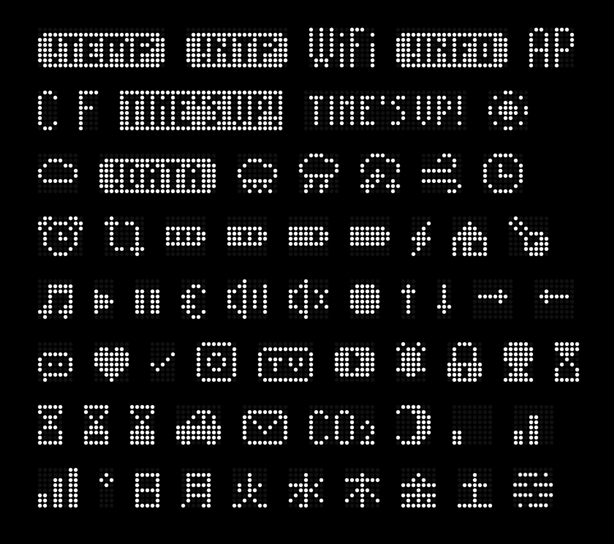

**Full Icons List**  
[NOTEMP][NONTP][WIFI][INFO][AP]  
[C][F][TIMEISUP][TIMEISUPINVERTED][SUNNY]  
[CLOUDY][NODATA][RAINY][THUNDER][SNOWY][WINDY][CLOCK]  
[ALARM][UPDATE][BATTERYEMPTY][BATTERY33][BATTERY66][BATTERYFULL][BOLT][HOUSE][TEMP]  
[MUSICNOTE][PLAY][SPACE][PAUSE][EURO][SPEAKER][SPEAKEROFF][RED][UP][DOWN][RIGHT][LEFT]  
[TALK][HEART][CHECK][INSTA][TV][YOUTUBE][BELL][LOCK][PERSON][HOURGLASS]  
[HOURGLASS25][HOURGLASS75][HOURGLASSFULL][CAR][MAIL][CO2][MOON][SIGNAL1][SIGNAL2]  
[SIGNAL3][DEG][SUNDAYJP][MONDAYJP][TUESDAYJP][WEDNESDAYJP][THURSDAYJP][FRIDAYJP][SATURDAYJP][MIST]

**How to use icons:**  
- Wrap the icon name in **brackets**: `[SUNNY] [YOUTUBE]`  
- Short messages (≤8 chars) = static & centered; longer = scrolling  
- Requires `mfactoryfont.h`; otherwise firmware falls back to Basic Font  
> For context, see: [Weird_font_displaying?_Heres_why_how_to_fix_it](https://www.reddit.com/r/ESPTimeCast/comments/1re6wh4/weird_font_displaying_heres_why_how_to_fix_it/)  

&nbsp;
## ⏱️ Timer v1.4.0

ESPTimeCast includes a built-in countdown timer that can be triggered via the **Custom Message** field in the Web UI or through **Home Assistant** (or any HTTP client).

### Starting a Timer

Send a custom message using the `[TIMER]` token with your desired duration:

| Format | Example | Description |
|--------|---------|-------------|
| `[TIMER xxH]` | `[TIMER 2H]` | 2 hours |
| `[TIMER xxM]` | `[TIMER 30M]` | 30 minutes |
| `[TIMER xxS]` | `[TIMER 90S]` | 90 seconds |
| `[TIMER xxHxxM]` | `[TIMER 1H30M]` | 1 hour 30 minutes |
| `[TIMER xxHxxMxxS]` | `[TIMER 1H30M45S]` | 1 hour 30 minutes 45 seconds |
| `[TIMER xx]` | `[TIMER 5]` | 5 minutes (number only defaults to minutes) |

You can combine the timer token with a message:
```
PIZZA IS READY IN [TIMER 20M]
```

### Timer Commands

Once a timer is running, you can control it by sending the following as a custom message:

| Command | Description |
|---------|-------------|
| `[TIMER STOP]` or `[TIMER CANCEL]` | Stops the timer and returns to clock |
| `[TIMER PAUSE]` | Pauses the timer at the current time |
| `[TIMER RESUME]` or `[TIMER START]` | Resumes a paused timer |
| `[TIMER RESTART]` | Restarts the timer from its original duration |

### Behavior

- While a timer is running, the display is **locked** — only messages sent with `allowInterrupt=0` can override it
- When the timer reaches zero, an alarm animation plays for 5 seconds before returning to the clock
- Timer state is **not persisted** across reboots

### Home Assistant Example
```yaml
service: rest_command.esptimecast_message
data:
  message: "PIZZA IS READY IN [TIMER 20M]"
```
### curl Example
```bash
# Start a 5 second timer
curl -X POST -d "message=[TIMER 5S]" "http://esptimecast.local/set_custom_message"

# Start a timer with a message
curl -X POST -d "message=PIZZA IS READY IN [TIMER 20M]" "http://esptimecast.local/set_custom_message"

# Pause the timer
curl -X POST -d "message=[TIMER PAUSE]" "http://esptimecast.local/set_custom_message"

# Stop the timer
curl -X POST -d "message=[TIMER STOP]" "http://esptimecast.local/set_custom_message"
```

> Replace `esptimecast.local` with your device's IP address if mDNS is not available on your network.

 
&nbsp;
## 🧩 Hidden & Advanced Features

ESPTimeCast™ includes a few optional “power-user” features that aren’t visible in the main interface but can be accessed directly from your browser. These are intended for advanced users who want more control or integration.

#### ⚙️ /factory_reset
Erases all saved configuration data, Wi-Fi credentials, and uptime history.
Used to restore the device to its original state. Only available in **AP mode**.

**Example:**  
```
http://192.168.4.1/factory_reset
```

#### 💾 /export
Downloads your current configuration (`config.json`) directly from the device.  
This is useful for creating backups or migrating settings between devices.

**Example:**  
```
http://your-device-ip/export
```
The file will download automatically with your saved WiFi credentials (safely masked for security) and all other settings.

#### 📂 /upload
Lets you manually upload a configuration file (`config.json`) to the device.  
Perfect for restoring a backup or quickly switching between setups.

**Usage:**
1. Go to  
   ```
   http://your-device-ip/upload
   ```
2. Select your edited or backup `config.json` file.  
3. The device will confirm the upload and automatically reboot with the new configuration.

> *Tip:* You can export → edit the file on your computer → re-upload to test new settings without using the web interface.


#### ⚕️ Nightscout Integration
ESPTimeCast supports displaying glucose data from **Nightscout** servers alongside weather information.

When the secondary NTP/URL field (`ntpServer2`) contains a valid Nightscout API endpoint for example:  
```
https://your-cgm-server/api/v1/entries/current.json?token=xxxxxxxxxxxxx
```
the device automatically enables **Glucose Display Mode**.

In this mode:
- The device fetches glucose data every 5 minutes.
- Glucose value and trend direction are displayed alternately with time and weather.
- The display duration for Nightscout data is the same as the weather display duration.
- Weather data continues to display normally.
- Debug logs confirm updates and Nightscout responses in the Serial Monitor.

#### ⚠️ Notes
- These features are optional and hidden from the main interface to avoid clutter.  
- `/upload` and `/export` are intentionally unlinked from the UI to prevent accidental access.  
- Always verify your WiFi credentials and tokens before uploading edited configurations.

&nbsp;
## 📺 Display Behavior

**ESPTimeCast™** automatically switches between two display modes: Clock and Weather.
If "Show Weather Description" is enabled, a third mode (Description) will display with a duration of 3 seconds, if the description is too long to fit on the display the description will scroll from right to left once.

What you see on the LED matrix depends on whether the device has successfully fetched the current time (via NTP) and weather (via OpenWeatherMap).  
The following table summarizes what will appear on the display in each scenario:

| Display Mode | 🕒 NTP Time | 🌦️ Weather Data | 📺 Display Output                              |
|:------------:|:----------:|:--------------:|:--------------------------------------------|
| **Clock**    | ✅ Yes      | —              | 🗓️ Day Icon + ⏰ Time (e.g. `@ 14:53`)           |
| **Clock**    | ❌ No       | —              |  `! NTP` (NTP sync failed)               |
| **Weather**  | —          | ✅ Yes         | 🌡️ Temperature (e.g. `23ºC`)                |
| **Weather**  | ✅ Yes      | ❌ No          | 🗓️ Day Icon + ⏰ Time (e.g. `@ 14:53`)           |
| **Weather**  | ❌ No       | ❌ No          |  `! TEMP` (no weather or time data)       |

#### How it works:

- The display automatically alternates between **Clock** and **Weather** modes (the duration for each is configurable).
- If "Show Weather Description" is enabled a third mode **Description** will display after the **Weather** display with a duration of 3 seconds.
- In **Clock** mode, if NTP time is available, you’ll see the current time plus a unique day-of-week icon. If NTP is not available, you'll see `! NTP`.
- In **Weather** mode, if weather is available, you’ll see the temperature (like `23ºC`). If weather is not available but time is, it falls back to showing the clock. If neither is available, you’ll see `! TEMP`.
- All status/error messages (`! NTP`, `! TEMP`) are big icons shown on the display.

**Legend:**
- 🗓️ **Day Icon**: Custom symbol for day of week (`@`, `=`, etc.)
- ⏰ **Time**: Current time (HH:MM)
- 🌡️ **Temperature**: Weather from OpenWeatherMap
- ✅ **Yes**: Data available
- ❌ **No**: Data not available
- — : Value does not affect this mode


&nbsp;
## 📣 Community & Help
If you need assistance, want to share your build, or discuss new features:  
👉 Join the ESPTimeCast Community on Reddit: [r/ESPTimeCast](https://www.reddit.com/r/ESPTimeCast/)
&nbsp;  
&nbsp;
## 🤝 Contributing
ESPTimeCast is a personal project, and to keep the codebase focused, stable, and aligned with the original vision, I’m not accepting pull requests at this time.  

If you have ideas, feature requests, bug reports, or improvements, please open an Issue instead - discussion is always welcome.  

**Forks, custom additions, and personal experiments are absolutely encouraged.** Feel free to build on ESPTimeCast in your own fork and make it your own 😉
&nbsp;  
&nbsp;
## 🛡️ ESPTimeCast™ Branding & Visual Policy

**ESPTimeCast™** is a project and brand created by M-Factory. The name, logo, and official firmware visuals are protected.

#### Using ESPTimeCast™ Firmware

**You may:**
- Build compatible hardware  
- Modify the firmware for personal, educational, or hobby use  
- Share your own builds publicly, as long as you do **not** imply affiliation or endorsement by ESPTimeCast™  

**You may not:**
- Use the ESPTimeCast™ name, logo, or official firmware screenshots in product marketing or sales listings  
- Present your product as “official ESPTimeCast™ hardware”  

**Recommended Wording for Community Builds:**  
> “ESPTimeCast™ firmware compatible – unofficial build”  

This ensures that your hardware is clearly independent of the official project.

#### Firmware Visuals

The ESPTimeCast™ firmware interface (including custom splash screens, fonts, and display layout styling) is the intellectual property of ESPTimeCast™.

- You may modify it for personal or educational projects  
- You may **not** use official visuals in commercial marketing or product photos without permission  

This helps prevent confusion between official ESPTimeCast™ products and community builds.

#### Why This Matters

Because the firmware has a unique and recognizable look, photos of your product running it can easily be mistaken for ESPTimeCast™ official products. Following this policy ensures:

- Your brand identity remains clear  
- Community makers can still create and share builds without causing confusion

#### License Note

- The ESPTimeCast™ firmware code is licensed under [GPL-3.0](LICENSE)    
- Code license does **not** grant rights to use ESPTimeCast™ branding or official firmware visuals for commercial purposes
&nbsp;
&nbsp;
## ❤️ Support this project
ESPTimeCast is an open-source passion project that blends art, engineering, and design.  
If you enjoy it, you can help keep the project growing - even something as simple as leaving a ⭐ on GitHub goes a long way.  

If you'd like to go a step further, you can also support development through the options below:

[](https://www.buymeacoffee.com/mfactory)  
[](https://www.paypal.me/officialuphoto)  
[](https://github.com/sponsors/mfactory-osaka)   
&nbsp;
&nbsp;

## 🚇 Subway Mode (Transit Text)

- Display slot: mode 7 in the rotation (after weather/description). Uses live text from the HA endpoint; falls back to the placeholder `No Transit Data` when empty.
- Toggle: Web UI Advanced setting “Show Subway Status” (maps to `/set_subway_enabled`).
- Rendering: >8 chars scroll once (honors padding when following weather with humidity), <=8 chars center for 3s, then advance.
- Normalization: transliterates to ASCII and keeps **A–Z, 0–9, space, colon, dash, slash**; everything else is removed.
- HA endpoints:
  - `POST /set_subway_enabled` with `value=on|off`
  - `POST /set_subway` with `text=<subway string>` (text is normalized as above)

#### Example (curl)

```
curl -X POST -d "value=on" "http://<device_ip>/set_subway_enabled"
curl -X POST -d "text=R2 5:12 PM" "http://<device_ip>/set_subway"
```

## 📜 Custom Message Sanitization (UI + HA)

- Backend sanitizer now keeps **uppercase letters A–Z, spaces, and the degree symbol (°)** only. All digits and punctuation are stripped server-side even if the Web UI input allows them.
- Parameters remain the same for `POST /set_custom_message`:
  - `message` (required; empty string clears)
  - `speed` 10–200
  - `seconds` 0–3600 (0 uses Weather Duration)
  - `scrolltimes` 0–100 (0 = infinite)
- Persistence rules:
  - Web UI messages are persistent.
  - HA messages are temporary and restore the UI message after expiry/clear.
  - HA clear (`message=`) removes only the temporary message; UI clear removes both.

#### Example (curl)

```
curl -X POST -d "message=HELLO WORLD&speed=60&seconds=15" "http://<device_ip>/set_custom_message"
```

## 🧭 Developer / Copilot Notes

- Endpoints: `/set_custom_message`, `/set_subway_enabled` (`value=on|off`), `/set_subway` (`text=`). Brightness remains `/set_brightness` (`value 0–15 or -1`).
- Normalization: `normalizeSubwayText` → uppercase ASCII, keeps A–Z, 0–9, space, colon, dash, slash; used before subway display.
- Message sanitizer: uppercase letters + spaces + optional degree symbol only; digits/punctuation are dropped server-side.
- Display order: subway is mode 7, scrolls once when longer than 8 chars; short text centers for 3s. Padding is added when following humid weather view.
- Parity: ESP32 and ESP8266 sketches share the same subway endpoints, normalization, and sanitization logic.


      


